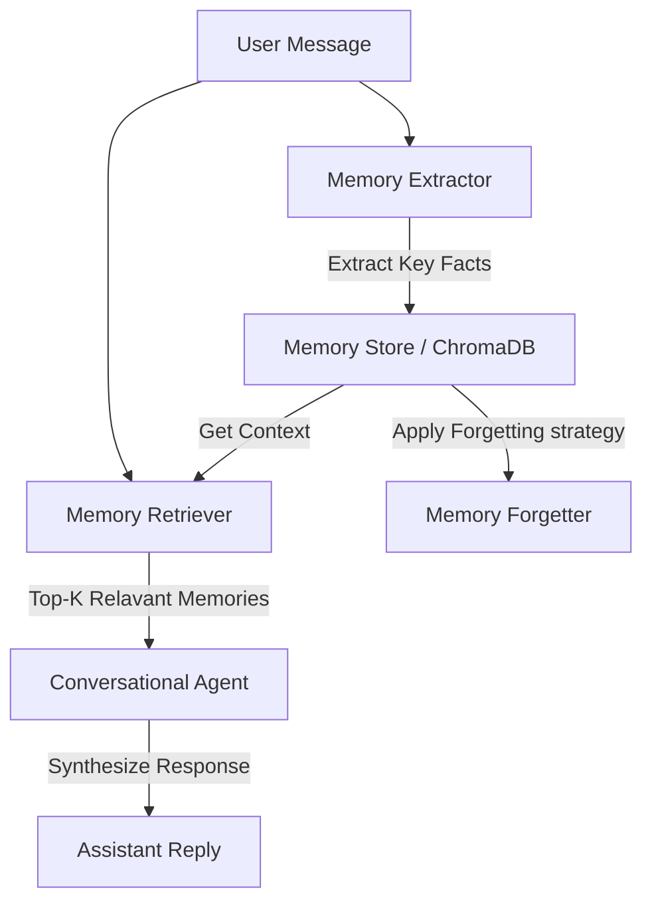

# MeshMind: Persistent Memory Architecture for Conversational AI

MeshMind is a production-style persistent memory architecture designed for conversational AI agents. It addresses the challenge of long-term context retention and relevance in multi-turn, multi-session interactions by integrating a vector database retriever with automated memory extraction, decay, and pruning strategies.

The system evaluates four distinct forgetting strategies to balance response personalization, factual faithfulness, retrieval precision/recall, and inference latency.

---

## Benchmark Results

| Condition | Precision | Recall | Hallucination Rate | Personalization | Coherence |
|---|---|---|---|---|---|
| No Memory | — | — | 83.3% | 3.58 / 5 | 5.0 / 5 |
| No Forgetting | 0.873 | 100% | 50.0% | 4.58 / 5 | 4.92 / 5 |
| Recency Decay | 0.882 | 100% | 41.7% | 4.50 / 5 | 5.0 / 5 |
| Hybrid | 0.773 | 100% | 41.7% | 4.67 / 5 | 4.92 / 5 |

## Key Findings

1. **Memory injection reduces hallucination by 50% relative** — No Memory 
   baseline hallucinated 83.3% of the time vs 41.7% for the best 
   memory-augmented conditions, demonstrating that grounded context 
   dramatically improves response faithfulness.

2. **Recency Decay achieves highest precision (0.882)** — By down-weighting 
   stale memories, the retriever returns more relevant context per query 
   than No Forgetting (0.873) or Hybrid (0.773), at the cost of slightly 
   lower personalization.

3. **Hybrid achieves best personalization (4.67/5) with lowest latency** 
   — Despite more aggressive memory management, Hybrid condition produced 
   the most personalized responses at the fastest average latency 
   (10,866ms vs 12,863ms for Recency Decay), suggesting that pruning 
   irrelevant memories improves both relevance and speed.

4. **Hallucination persists even with memory augmentation (41.7%)** — 
   A key finding: memory injection alone is insufficient for full 
   faithfulness. The model occasionally generates claims beyond the 
   injected context, indicating that output grounding or constrained 
   decoding is a necessary next step for production deployment.

5. **All memory conditions achieved 100% recall** — Every ground-truth 
   relevant memory was retrieved at least once, confirming the 
   SentenceTransformer + ChromaDB retrieval pipeline is effective 
   for this domain.

---

## Architecture Overview

MeshMind's pipeline processes each user interaction through four distinct stages:



1. **Extraction**: Identifies core facts, preferences, and details from user messages.
2. **Storage**: Persists extracted facts as vector embeddings in a ChromaDB database.
3. **Retrieval**: Uses semantic similarity search (via SentenceTransformers) to fetch the top-k relevant memories.
4. **Forgetting (Ablation)**: Applies one of four memory retention models:
   - **No Memory**: Baseline. Context is empty.
   - **No Forgetting**: Infinite retention (metadata is not updated, no pruning).
   - **Recency Decay**: Down-weights old memories exponentially based on a half-life parameter.
   - **Hybrid**: Applies Recency Decay and aggressively prunes memories that fail to meet retrieval frequency thresholds.

---

## Installation & Setup

1. **Clone the Repository**
   ```bash
   git clone <repository-url>
   cd MeshMind
   ```

2. **Set Up a Virtual Environment**
   ```bash
   python -m venv venv
   source venv/bin/activate  # On Windows: venv\Scripts\activate
   ```

3. **Install Dependencies**
   ```bash
   pip install -r requirements.txt
   ```

4. **Configure Environment Variables**
   Create a `.env` file in the root directory and add your Groq API key:
   ```env
   GROQ_API_KEY=your_groq_api_key_here
   ```

---

## Usage

### 1. Running the Benchmark Pipeline
To evaluate agent performance across all forgetting strategies:
```bash
python scripts/run_benchmark.py
```
This runs evaluations over the multi-turn dataset configured in `configs/config.yaml` and outputs the result summary in `results/benchmark_results.json`.

### 2. Running the Ablation Study
To run specific ablation scenarios:
```bash
python scripts/run_ablation.py
```

### 3. Launching the Visualization Dashboard
MeshMind includes a Streamlit dashboard to analyze memory profiles, run individual chat sessions, and inspect details of the benchmark results:
```bash
streamlit run dashboard/app.py
```
